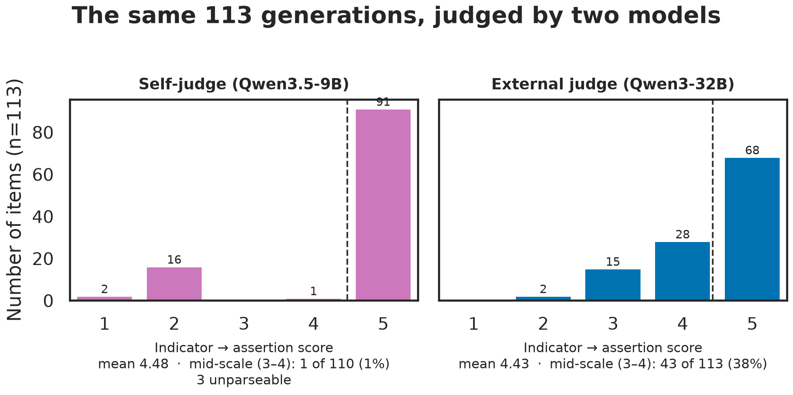

# Framework-Grounded Survey Item Generation

A prompt-driven, two-agent LLM pipeline that turns raw survey indicators into framework-conformant
survey items, following Saris & Gallhofer's three-step design method
(indicator → basic concept + semantic structure → assertion → respondent-facing question).

Built on **Qwen3.5-9B** served with vLLM and constrained JSON decoding, evaluated against a
hand-built 113-item gold set spanning all 22 basic concepts of the framework.

Seminar project, NLP for Computational Social Science, LMU Munich.
Authors: Lanre Oriowo, Rudraksha Samdhani.

---

## Results

Seven controlled prompt-engineering runs, no fine-tuning, all scored on the same 113 items:

| Metric | Run 1 | Run 3 | Run 6 | R7a | R7b | **R7c (best)** |
|--------|-------|-------|-------|-----|-----|----------------|
| Concept accuracy | 65.5% | 75.2% | 76.1% | 78.8% | 77.9% | **85.0%** |
| Structure accuracy | 51.3% | 61.1% | 74.3% | 76.1% | 73.5% | **79.6%** |
| Both correct | 47.8% | 59.3% | 72.6% | 74.3% | 71.7% | **79.6%** |
| Question exact match | 20.4% | 18.6% | 17.7% | 20.4% | 20.4% | 20.4% |

95% Wilson interval on the best concept figure: **[77.2, 90.4]**.

**Read the numbers with these four caveats.** They are the point of the project, not footnotes:

1. **Only two of six run-to-run transitions are statistically significant** (exact McNemar on
   paired items): Run 3 → Run 6 structure (*p* = 0.024) and R7b → R7c concept (*p* = 0.039).
   Everything else is within noise at n = 113.
2. **A large part of the early gain was a scoring change, not a model change.** Re-scoring Run 1
   under Run 2's normalizer moves it 57.5% → 65.5%, so **8.0 of the 11.5-point** Run 1 → Run 2
   concept gain came from the measuring instrument.
3. **All numbers are in-sample.** Prompts were written by inspecting errors on these same items.
   R7b and R7c remove every verbatim gold item from the prompt, but the *rules* were still
   written by someone who had seen the data. Treat these as measures of fit, not generalization.
4. **Structure accuracy is not independent of concept accuracy.** P(structure correct | concept
   correct) = 93.8%; when the concept is wrong it is 0.0%. Report the conditional figure.

### Two control experiments

**No self-preference bias, but a degenerate judge.** A 2×2 design (each of two models judges both
models' generations) finds each judge scores both generators within 0.05 points — the 32B is
marginally *harsher* on its own output. The real finding is distributional: on identical
generations the 9B self-judge places **1%** of items in the middle of its five-point scale
against **38%** for the 32B, while the two means differ by 0.05. Report distributions, not means.



**Scale is not the lever.** Running the identical best prompt through Qwen3-32B — 3.5× larger —
gives 77.0% concept / 68.1% structure, *below* the 9B pipeline. Framework adherence responds to
how the taxonomy is expressed, not to model capacity.

### Reference points

| System | Concept | Structure |
|--------|---------|-----------|
| Majority class | 16.8% | — |
| Lexical 1-NN (TF-IDF, leave-one-out) | 32.7% | 31.0% |
| Qwen3-32B generator, same prompt | 77.0% | 68.1% |
| **Qwen3.5-9B pipeline (R7c)** | **85.0%** | **79.6%** |

Full write-up: [`docs/BASELINE_REPORT.md`](docs/BASELINE_REPORT.md).
Machine-readable numbers: [`docs/reanalysis.json`](docs/reanalysis.json).

---

## Gold set

113 items, 22 basic concepts, ~40 application domains, 71 subjective / 42 objective.

The set was built with 115 items and corrected on 2026-08-24:

- **Two exact duplicates removed** (ids 71 and 67 duplicate ids 5 and 29 — identical indicator,
  concept *and* structure). Id 71 was also one of the items quoted verbatim in the early prompts,
  so keeping it counted a memorized item twice.
- **Evaluative-belief notation standardized** on `xP(e)y` / `xP(e)`. The gold labels had used
  three different notations for one concept and `concepts.yaml` licensed a fourth. Note the
  direction: the model consistently produces one of the discarded variants, so this correction
  *lowers* reported structure accuracy by about a point. Standardizing the other way would have
  raised it by moving the reference toward what our own prompt teaches.

Corrections are replayed onto earlier runs offline by [`src/sig/gold_fixes.py`](src/sig/gold_fixes.py),
so no run had to be repeated on a GPU.

> ⚠️ The `eval_summary_*.json` files in `docs/baseline/` were written at run time against the
> uncorrected 115-item set and are **stale**. `docs/reanalysis.json` is the single source of truth.

---

## Repo layout

```
├── config.yaml                  # model endpoints, judge, eval settings
├── data/
│   ├── gold_set.xlsx            # 113-item gold set
│   └── concepts.yaml            # 22 concepts, structures, notation symbols
├── src/sig/
│   ├── agents.py                # Assertion + Question developers
│   ├── pipeline.py              # indicator → assertion → question
│   ├── llm_client.py            # vLLM client + MockLLMClient
│   ├── loader.py, schema.py, normalize.py
│   ├── gold_fixes.py            # gold corrections + offline re-scoring
│   ├── prompts/                 # assertion_developer{,_v7a,_v7b}.md, question_developer.md
│   └── evaluation/              # run_eval.py, metrics.py, judge.py
├── scripts/
│   ├── run7.sh                  # the full Run 7 SLURM job (all three stages)
│   ├── start_vllm.sh            # generator server, port 8000
│   ├── start_vllm_judge.sh      # judge server, port 8001, TP=2
│   ├── run_judge_only.py        # re-score an existing CSV with any judge
│   ├── reanalysis.py            # ALL statistics — no GPU needed
│   ├── generate_figures.py      # all 15 publication figures
│   └── activate_env.sh, setup_cuda_libs.sh
├── docs/
│   ├── BASELINE_REPORT.md       # per-run write-up, Runs 1–7
│   ├── REVIEW_RESPONSE.md       # response to the paper review
│   ├── reanalysis.json          # canonical numbers
│   ├── baseline/                # committed per-item CSVs + summaries
│   └── figures/                 # fig01–fig15 (PDF + PNG) + FIGURES.md
├── Seminar_Paper/               # LaTeX source, figures, references.bib
└── outputs/                     # runtime artifacts (gitignored)
```

---

## Reproducing the analysis (no GPU)

Every statistic and figure in the paper is reproducible from the committed per-item CSVs:

```bash
conda env create -f environment.yml && conda activate sig-llm
python scripts/reanalysis.py           # → docs/reanalysis.json
python scripts/reanalysis.py --self-check
python scripts/generate_figures.py     # → docs/figures/
```

`reanalysis.py` computes the Wilson intervals, the exact McNemar tests, the leakage split, the
2×2 judge table, the no-LLM baselines, and the generator comparison.

---

## Reproducing the runs (needs GPUs)

Models are served locally with vLLM. Paths below are LRZ-specific; edit
`config.yaml`, `scripts/start_vllm.sh` and `scripts/start_vllm_judge.sh` for your cluster.

| Role | Model |
|------|-------|
| Generator | `Qwen/Qwen3.5-9B` (1 GPU, port 8000) |
| External judge | `Qwen/Qwen3-32B` (2 GPUs, TP=2, port 8001) |
| External judge (Run 5 only) | `Qwen/Qwen2.5-72B-Instruct` — removed from our shared store mid-project |

### The whole thing in one job

```bash
sbatch scripts/run7.sh                    # 2 GPUs, 5 h, three stages
RUN7_SKIP_STAGE1=1 bash scripts/run7.sh   # resume from the judge stage
```

Inside an existing `salloc`, enter the node **without `--overlap`**:

```bash
srun --jobid=<JOBID> --pty bash
```

> ⚠️ `srun --overlap` gives the step only **one** GPU even when the allocation holds two, and
> Stage 2 needs TP=2. This silently produces a one-GPU step that fails at model load.

### Individual stages

```bash
# generator server (terminal 1, on the compute node)
bash scripts/start_vllm.sh

# a single eval run (terminal 2, same node)
python -m src.sig.evaluation.run_eval --tag mytag \
  --assertion-prompt src/sig/prompts/assertion_developer_v7b.md

# judge an existing prediction CSV, no regeneration
bash scripts/start_vllm_judge.sh
python scripts/run_judge_only.py docs/baseline/eval_report_vllm_v7b_20260824_103350.csv --tag myjudge
```

Mock mode needs no GPU at all — set `llm.mock: true` in `config.yaml` and run the same commands.

---

## The paper

LaTeX source in [`Seminar_Paper/`](Seminar_Paper/). It builds with pdfLaTeX, or:

```bash
tectonic -X compile Seminar_Paper/conference_101719.tex
```

`\bibliographystyle{ieeetr}` is used so no `.bst` file needs shipping.

---

## Known limitations

Stated plainly, because they bound what the numbers mean:

- **No held-out split.** See caveat 3 above. Closing this needs indicators annotated *after* the
  prompts are frozen.
- **No inter-annotator agreement.** The gold set is expert-annotated but we do not report how
  many annotators, their agreement, or how disagreements were resolved. Some scored errors may be
  label disagreements, most likely in the Norms/Policies/Values cluster.
- **The judge substitution is confounded.** Qwen2.5-72B was deleted from the shared model store
  mid-project. The 72B-vs-32B leniency gap (4.09 vs 4.51 on identical items) cannot be decomposed
  into scale, model family, and reasoning-mode effects.
- **Neither judge is validated against human ratings.** The 2×2 shows the small judge is
  unreliable; it cannot show the larger one is right.
- **The prompts currently contradict the gold set.** `concepts.yaml` injects
  `Evaluative belief → xP(e)y`, while the prompt tables still teach `xPyc`. Fixing this is the
  next run; do not edit the existing prompt files, or Runs 6 and 7 stop being reproducible.
- **Question format is a degenerate field** — one value across all 113 items. Answer options
  score 61.1% response-type agreement, the weakest part of the pipeline.
- English only, single model family, single-facet indicators.

---

## Notes

- vLLM and the Python client must run on the **same compute node**.
- Use `scripts/start_vllm.sh` rather than bare `vllm serve` — LRZ needs specific attention-backend
  and eager-execution flags to run stably.
- Evaluation is **isolated**: the Question Developer is scored on *gold* assertions, not on the
  assertion the first stage just produced, so stage-1 errors cannot contaminate stage-2 measurement.
- Decoding is deterministic (temperature 0), so runs reproduce given the same config and model.
