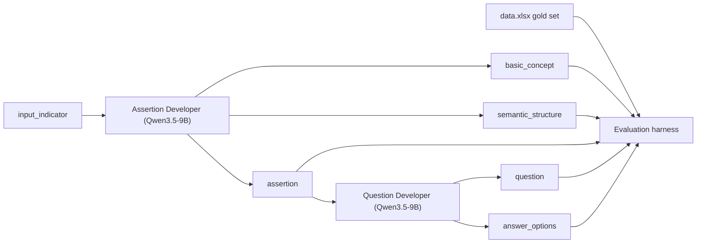
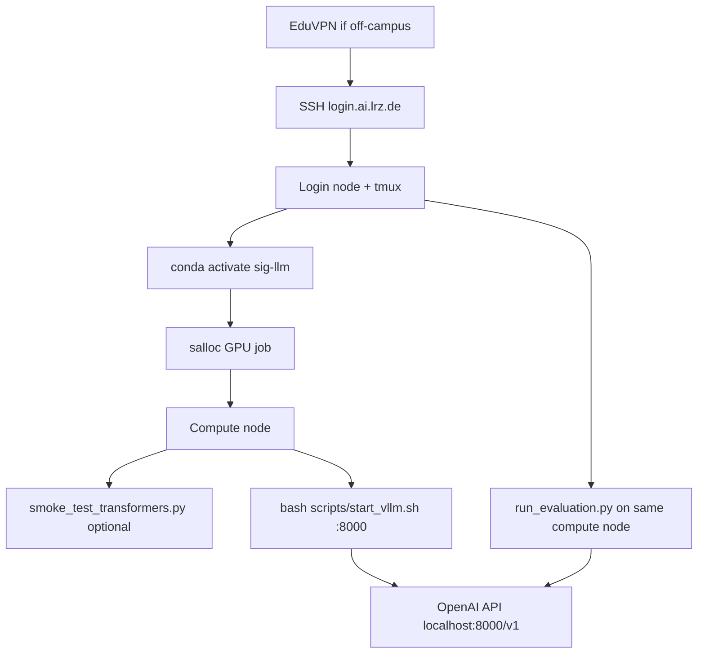

## Progress Update (2026-06-19)

Completed locally:

- Created Phase 1 project scaffold
- Added concept.yaml reference file from protocol framework
- Implemented normalize.py utilities
- Implemented data loader
- Implemented LLM client
- Implemented MockLLMClient for local development
- Dynamically incorporated concept.yaml file into the prompts, ensuring LLM always has the latest rules without manual prompt editing. 
- Implemented AssertionDeveloper agent
- Implemented QuestionDeveloper agent
- Implemented SurveyPipeline
- Implemented initial eveluation metrics
- Implemented local evaluation runner
- Successfully executed end-to-end pipeline using mock responses.

Next steps (2026-06-20):

- Request new GPU job on LRZ (`salloc` / `srun`)
- Start vLLM with `bash scripts/start_vllm.sh`
- Set `mock: false` in `config.yaml` and run `run_test_pipeline.py` on one gold row
- Fix vLLM JSON schema for question stage; handle Qwen3.5 thinking output if needed
- Wire `normalize.py` into metrics; add question-format + confusion matrix
- Implement `judge.py` (LLM-as-judge alignment scores)
- Isolated eval mode (question dev on gold assertions)
- Full 115-row run + reports to `outputs/`
- Add `scripts/run_evaluation.sh` sbatch wrapper


# Survey Item Generator: Prompting Baseline + Evaluation

## Goal

Implement Caro's two ideas as a prompt-driven pipeline and evaluate it against the gold set, before any fine-tuning.

- Step 2 Assertion Developer: `input_indicator` -> `basic_concept` + `semantic_structure` + `assertion`
- Step 3 Question Developer: `assertion` -> `question` + `answer_options`
- Evaluation harness scoring both agents against `data.xlsx`

## Architecture



vLLM runs as an OpenAI-compatible server on an LRZ GPU compute node (not the login node) loading the local model at `/dss/dssmcmlfs01/pn25ju/pn25ju-dss-0000/models/Qwen3.5-9B`. The pipeline and harness are plain Python clients hitting that endpoint. All Python work runs inside a dedicated conda env **`sig-llm`** on LRZ, following the [Week 3 lrz-tutorial.pdf](../Week%203%20lrz-tutorial.pdf) workflow.



## GitHub repo connection (Phase 0 — first step)

Remote: **https://github.com/richienod0llar/nlp-css-seminar** (private). All project code lives in **`~/nlp-css-seminar/`** after clone. Your home directory keeps seminar docs separately unless you choose to move them into the repo later.

**Status: done (2026-06-16).** Repo at `~/nlp-css-seminar/`. Remote: `git@github.com:richienod0llar/nlp-css-seminar.git`. Branch: `main`, pushed to GitHub (Phase 0 infra commits). SSH auth works (key has a passphrase; run `ssh-add ~/.ssh/id_ed25519_github` once per session before non-interactive git push).

**Workflow going forward:** all project work happens inside `~/nlp-css-seminar/` and gets pushed to this repo. Commits only when explicitly requested; after each meaningful milestone, push to `origin main` (or a feature branch if we split work).

### 1. Generate an SSH key on LRZ (if you do not already have one for GitHub)

On the login node:

```bash
ssh-keygen -t ed25519 -C "your_email@example.com" -f ~/.ssh/id_ed25519_github
# press Enter for no passphrase, or set one if you prefer
cat ~/.ssh/id_ed25519_github.pub
```

Copy the **public** key output.

### 2. Add the key to GitHub

1. GitHub → **Settings** → **SSH and GPG keys** → **New SSH key**
2. Paste the public key, save

Alternatively use a **Personal Access Token (PAT)** for HTTPS clone, but SSH is simpler for ongoing push/pull on LRZ.

### 3. Configure SSH to use this key for GitHub

Add to `~/.ssh/config`:

```
Host github.com
  HostName github.com
  User git
  IdentityFile ~/.ssh/id_ed25519_github
  IdentitiesOnly yes
```

Test:

```bash
ssh -T git@github.com
# expect: "Hi richienod0llar! You've successfully authenticated..."
```

### 4. Clone the private repo

```bash
cd ~
git clone git@github.com:richienod0llar/nlp-css-seminar.git
cd nlp-css-seminar
git remote -v
git branch -a
git status
```

If the repo is empty, you will see an empty directory or only a README; that is fine — we scaffold the project inside it.

If clone fails with "repository not found", confirm: (a) Bolei/Lanre added your GitHub user as collaborator, (b) repo name is exact.

### 5. Wire in existing local files

Keep protocol docs in home or add to repo as needed:

| File | Location in repo (current) |
|------|----------------------------|
| Gold set | `data/gold_set.xlsx` |
| Protocol / LRZ docs | Repo root + `docs/PLAN.md` |
| Implementation plan | `docs/PLAN.md` |

Add to `.gitignore` (root, still TODO): `outputs/logs/`, `*.log`, `.env`, `__pycache__/`. Today only `outputs/.gitignore` ignores `logs/`.

### 6. Git workflow during development

```bash
cd ~/nlp-css-seminar
git checkout -b feature/assertion-question-agents   # or main if solo
# ... work ...
git add -A && git status
git commit -m "Add assertion developer scaffold"
git push -u origin feature/assertion-question-agents
```

We only commit when you explicitly ask (per your rules). Default: work on a feature branch, push when ready.

### GitHub setup checklist

- [x] SSH key generated on LRZ
- [x] Public key added to GitHub account
- [x] `ssh -T git@github.com` succeeds
- [x] `~/nlp-css-seminar/` cloned, `origin` points to correct URL
- [x] First commit pushed (Phase 0 infra on `main`)

**Note:** SSH key has a passphrase. Before git push from a non-interactive session, run in your terminal:

```bash
eval "$(ssh-agent -s)"
ssh-add ~/.ssh/id_ed25519_github
```

## LRZ environment setup (Phase 0 — after GitHub clone)

Based on [Week 3 lrz-tutorial.pdf](../Week%203%20lrz-tutorial.pdf). **Login nodes cannot run GPU jobs**; you must request a GPU via SLURM (`salloc` or `sbatch`), then activate your conda env on the compute node.

### 0. Connect to LRZ

1. On-campus: MWN or eduroam. Off-campus: install [EduVPN](https://www.eduvpn.org/client-apps/).
2. SSH: `ssh <username>@login.ai.lrz.de` (optional `Host lrz` in `~/.ssh/config`).
3. Web portal (files, jobs): https://login.ai.lrz.de/
4. Start **tmux** so work survives disconnects: `tmux`

Paths:

- Personal storage (100 GB): `/dss/dsshome1/02/<username>/` (yours: `/dss/dsshome1/02/ra35tif2/`)
- Shared models (read-only): `/dss/dssmcmlfs01/pn25ju/pn25ju-dss-0000/models/Qwen3.5-9B`
- Do not modify or delete shared storage (see usage guidelines in tutorial)

**Optional — VS Code Remote-SSH (tutorial pp. 20–26):** generate `ssh-keygen -t ed25519`, upload public key to `~/.ssh/authorized_keys` via LRZ web file manager, then connect VS Code to `login.ai.lrz.de` and edit `~/nlp-css-seminar/` while SLURM jobs run on compute nodes.

### 1. Install Miniconda (once, if not already present)

```bash
wget https://repo.anaconda.com/miniconda/Miniconda3-latest-Linux-x86_64.sh
bash Miniconda3-latest-Linux-x86_64.sh
source ~/miniconda3/etc/profile.d/conda.sh   # add to ~/.bashrc for persistence
```

Useful commands: `conda env list`, `conda activate sig-llm`, `conda list`, `conda remove -n sig-llm --all`.

### 2. Create the project conda env `sig-llm`

**Status: done.** Miniconda at `~/miniconda3/`. Env `sig-llm` (Python 3.11). PyTorch pinned to cu126 (`torch==2.11.0+cu126`). vLLM `0.23.0`. Use `source ~/nlp-css-seminar/scripts/activate_env.sh` (activates conda + CUDA lib paths).

Name: **`sig-llm`** (Python 3.11; tutorial uses `llm` — we use a project-specific name).

```bash
conda create -n sig-llm python=3.11 -y
conda activate sig-llm

# GPU PyTorch (CUDA 12.6) — see scripts/install_pytorch.sh for pinned versions
bash scripts/install_pytorch.sh

pip install vllm==0.23.0
pip install -r requirements-llm.txt
pip install -r requirements.txt
```

Tutorial `requirements-llm.txt` baseline (we extend with `vllm`):

```
transformers>=4.41.0
datasets>=2.20.0
accelerate>=0.30.0
huggingface_hub>=0.23.0
tokenizers>=0.19.0
scipy numpy pandas tqdm tensorboard python-dotenv
vllm   # added for OpenAI-compatible serving
```

We will split dependencies into two files in the repo:

- `requirements-llm.txt`: torch-adjacent + vLLM + HuggingFace stack (install on GPU node)
- `requirements.txt`: lightweight pipeline/eval client deps (can also run on login node for data prep, but inference must be on GPU node)

Also add `environment.yml` in the repo for reproducibility (`name: sig-llm`, `python=3.11`).

### 3. Request a GPU (interactive development)

Check partitions: `sinfo`

General LRZ (example from tutorial):

```bash
salloc -p lrz-hgx-h100-94x4 --time=0-2:00:00 --gres=gpu:1
# once allocated:
srun --pty bash
conda activate sig-llm
nvidia-smi   # verify GPU visible
```

MCML partition (requires `-q mcml`):

```bash
salloc -p mcml-dgx-a100-40x8 -q mcml --time=0-2:00:00 --gres=gpu:1
srun --pty bash
conda activate sig-llm
```

For Qwen3.5-9B + vLLM, **1 GPU** is enough (A100 40GB/80GB or H100 both fine). Enter the node with `srun --pty bash` or `srun --jobid=<JOBID> --overlap --pty bash` (job ID from https://login.ai.lrz.de/ dashboard).

### 4. Sanity check: transformers load

**Status: done.** On the compute node:

```bash
source ~/nlp-css-seminar/scripts/activate_env.sh
cd ~/nlp-css-seminar
python scripts/smoke_test_transformers.py
```

The script sets `TORCH_CUDNN_SDPA_ENABLED=0` and `attn_implementation="eager"` to avoid cuDNN SDPA issues on LRZ H100 stacks.

### 5. Start the vLLM model server

**Status: done (interactive).** Do not run the bare `vllm serve ... --dtype auto` command on LRZ; it crashes on inference (CUDA 13 runtime vs driver 12.2, FlashAttention 3).

#### LRZ + vLLM 0.23 workarounds (required)

LRZ H100 nodes ship **driver CUDA 12.2**. vLLM 0.23 wheels link **`libcudart.so.13`**. Without fixes you get:

- `CUDA driver version is insufficient for CUDA runtime version` (FlashAttention / custom ops)
- FlashInfer JIT failures (`nvcc` / header mismatch)

**Fixes in repo:**

| File | Purpose |
|------|---------|
| `scripts/setup_cuda_libs.sh` | cu12 libs first, cu13 appended for extension load; `CUDA_HOME` for nvcc |
| `scripts/activate_env.sh` | conda activate + sources setup_cuda_libs |
| `scripts/start_vllm.sh` | Correct vLLM flags + logs to `outputs/logs/vllm_startup_*.log` |
| `scripts/start_vllm_debug.sh` | Same with `VLLM_LOGGING_LEVEL=DEBUG` |

**Required vLLM flags** (already in `start_vllm.sh`):

- `--attention-backend TRITON_ATTN` (not `FLASH_ATTN`; FA3 crashes on LRZ)
- `--gdn-prefill-backend triton`
- `--compilation-config '{"custom_ops":["none"]}'`
- `--enforce-eager`
- `export VLLM_USE_FLASHINFER_SAMPLER=0`

#### Interactive startup (terminal 1)

```bash
srun --jobid=<JOBID> --overlap --pty bash   # or srun --pty bash inside salloc
cd ~/nlp-css-seminar
bash scripts/start_vllm.sh
```

Wait for `Application startup complete`. Logs: `outputs/logs/vllm_startup_<timestamp>.log`.

#### Test (terminal 2 — new Cursor tab or second `srun` into same job)

```bash
srun --jobid=<JOBID> --overlap --pty bash
source ~/nlp-css-seminar/scripts/activate_env.sh
cd ~/nlp-css-seminar
curl http://localhost:8000/v1/models
python scripts/smoke_test_llm.py
```

First chat request may take 30–60s (Triton JIT). Qwen3.5 may emit "Thinking Process" text with low `max_tokens`; that is model behavior, not a server error.

**Planned `config.yaml` (Phase 1):**

```yaml
llm:
  base_url: "http://localhost:8000/v1"
  model: "/dss/dssmcmlfs01/pn25ju/pn25ju-dss-0000/models/Qwen3.5-9B"  # vLLM returns full path as model id
  api_key: "EMPTY"
```

**Important:** vLLM and the Python client must run on the **same compute node**. Use a second terminal tab with `srun --jobid=<ID> --overlap --pty bash`, not the login node.

### 6. Batch jobs via sbatch (Phase 1 — not yet implemented)

`scripts/start_vllm.sh` today is **interactive only** (no `#SBATCH` headers). For full 115-row eval, add sbatch wrappers that:

1. `source scripts/activate_env.sh` (not bare `conda activate`)
2. Call the same vLLM flags as `start_vllm.sh` (or `exec scripts/start_vllm.sh` after adding SBATCH headers to a separate `scripts/sbatch_vllm.sh`)

**Planned `scripts/run_evaluation.sh`:**

```bash
#!/bin/bash
#SBATCH --job-name=sig-eval
#SBATCH --partition=lrz-hgx-h100-94x4
#SBATCH --time=02:00:00
#SBATCH --gres=gpu:1
#SBATCH --cpus-per-task=4
#SBATCH --mem=16G
#SBATCH --output=outputs/logs/eval_%j.log

source ~/nlp-css-seminar/scripts/activate_env.sh
cd ~/nlp-css-seminar
python scripts/run_evaluation.py --config config.yaml
```

Pattern for eval: single sbatch script starts vLLM in background, waits for `/health`, runs eval, stops server.

- `scancel <job-id>` — cancel job

### 7. Fallback: direct transformers

vLLM works on LRZ with the workarounds above. Keep `smoke_test_transformers.py` as a diagnostic if vLLM breaks after upgrades. Agents could temporarily use in-process HuggingFace inference only as a last resort.

### Setup checklist (Phase 0 gate)

- [x] GitHub SSH key on LRZ + added to GitHub account
- [x] `ssh -T git@github.com` succeeds
- [x] `~/nlp-css-seminar/` cloned; commits pushed to `origin/main`
- [x] SSH + tmux to LRZ working
- [x] Miniconda installed (`~/miniconda3/`)
- [x] Env `sig-llm` created
- [x] PyTorch sees GPU on compute node
- [x] Shared model path readable
- [x] `smoke_test_transformers.py` passes
- [x] vLLM installed (`vllm==0.23.0`)
- [x] `bash scripts/start_vllm.sh` → `Application startup complete`
- [x] `smoke_test_llm.py` returns a chat completion (`POST /v1/chat/completions` 200)

## Key resources to leverage

- Gold set: `data/gold_set.xlsx` (115 rows, all 22 basic concepts). Columns: `example_id, input_indicator, basic_concept, semantic_structure, assertion, question, answer_options, domain, source_type, confusable_with`.
- Annotation Guide in the protocol doc is the first draft of the Assertion Developer prompt: the 22 basic concepts (14 subjective + 8 objective), the 3 semantic structures, the per-concept structure-code table, the notation key, the 4 question formats, the 3 worked reference rows, and the confusable-concept heuristics. These get encoded directly into prompts and a `concepts` reference module.

## Project layout (`~/nlp-css-seminar/`)

### Exists today

| Path | Status |
|------|--------|
| `config.yaml` | LLM + data paths; `mock: true` by default |
| `data/gold_set.xlsx` | Gold set (115 rows) |
| `data/concepts.yaml` | 22 concepts, structures, notation |
| `src/sig/` | Agents, pipeline, LLM client, loader, prompts, eval |
| `run_test_pipeline.py`, `test_load.py` | Local test scripts |
| `docs/PLAN.md`, `README.md` | Documentation |
| `environment.yml`, `requirements*.txt` | Dependencies |
| `outputs/.gitignore` | Ignores `logs/` |
| `scripts/activate_env.sh`, `setup_cuda_libs.sh` | Conda + LRZ CUDA workaround |
| `scripts/start_vllm.sh` | Interactive vLLM (working on H100) |
| `scripts/smoke_test_*.py` | Phase 0 smoke tests |
| Protocol doc, LRZ tutorial PDF | Repo root |

### Still to build

- `src/sig/evaluation/judge.py` — LLM-as-judge (empty stub)
- Isolated eval mode + full 115-row runner with CSV/JSON reports
- Question-format metric, confusion matrix, normalized matching in metrics
- Separate JSON schemas for assertion vs question in `llm_client.py`
- `scripts/run_evaluation.sh` — sbatch wrapper for batch eval
- Root `.gitignore` cleanup (done 2026-06-20)

## Evaluation design (from the protocol's criteria tables)

Primary mode is per-agent isolated evaluation (matches the doc: Question Developer is evaluated on gold assertions, not chained output).

Assertion Developer (input = gold `input_indicator`):
- Identification of basic concept (objective): accuracy of predicted vs gold `basic_concept` (normalized) + per-concept confusion matrix; `confusable_with` used for error analysis.
- Correct semantic structure (objective): predicted structure number + code matches gold (normalized via the per-concept code table).
- Concept-assertion alignment (rated 4/5 objective): LLM-as-judge 1-5 that the assertion faithfully represents the indicator.

Question Developer (input = gold `assertion`):
- Question format (objective): classify the generated question into one of the 4 formats (direct/indirect x interrogative/imperative) and record it.
- Assertion-question alignment (rated 4/5 objective): LLM-as-judge 1-5 that the question represents the assertion.

Report: overall accuracy, per-concept and per-structure breakdowns, mean judge scores, plus a per-row predictions-vs-gold table for manual spot-check.

## Decisions I am making (adjust if you disagree)

- LLM-as-judge for the two alignment metrics, model configurable; default to a stronger local model (`Qwen2.5-72B-Instruct` is available on LRZ) to avoid self-grading bias. The 3 objective metrics need no judge.
- Agents return strict JSON (vLLM guided/JSON decoding) for robust parsing.
- Gold-set normalization layer rather than editing `data.xlsx`, so the source file is untouched.

## Implementation order

**Phase 0 — Infra: complete (2026-06-16)**

0. GitHub SSH auth + clone + push
1. Conda env `sig-llm` + PyTorch cu126 + vLLM 0.23
2. GPU access via `salloc` / `srun`
3. Transformers smoke test
4. vLLM server + API smoke test (LRZ CUDA workarounds)

**Phase 1 — Pipeline (in progress, 2026-06-19)**

5. ~~Scaffold, concepts, gold loader~~ done
6. ~~Agents + prompts + mock pipeline~~ done
7. Connect to real vLLM (`mock: false`) — **next**
8. Finish eval harness (judge, metrics, isolated mode, reports)
9. Full 115-row run via sbatch

## Open items to confirm with the team (not blockers)

- Which SLURM partition to use by default: general LRZ (`lrz-dgx-a100-94x4` / `lrz-hgx-h100-94x4`) vs MCML (`mcml-dgx-a100-40x8 -q mcml`). Tutorial shows both; we template general LRZ and note MCML flag.
- Whether Miniconda is already installed on your account — **yes**, at `~/miniconda3/`.
- Judge model: if running Qwen2.5-72B for LLM-as-judge, may need a second GPU job or a separate allocation.
- Indicator granularity question already flagged for Caro in the guide (single facet vs broad topic) only affects future test-data expansion, not this baseline.